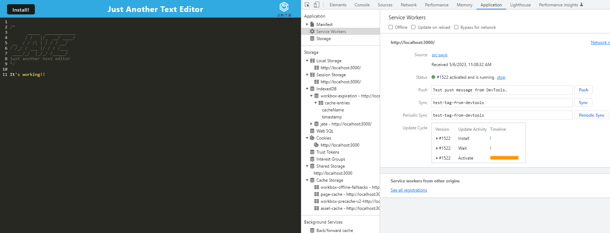
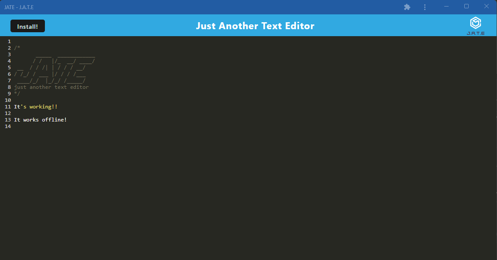

# Text Editor At Your Service

## Description

This challenge is a Progressive Web App (PWA) text editor that runs in the browser and can also be installed on the desktop. It uses an IndexedDB databse to store and retrieve data.

## Table of Contents

- [Installation](#installation)
- [Applications Used](#applications-used)
- [Screenshots](#screenshots)
- [Deployed Application](#deployed-application)
- [License](#license)

## Installation

Clone the code from this repository, open the integrated terminal in the root directory and run the following commands:

    npm i
    npm start

## Applications Used

Express, Workbox, Webpack, Concurrently, IndexedDb, Manifest, Babel

## Screenshots

## Deployed Application

## License

